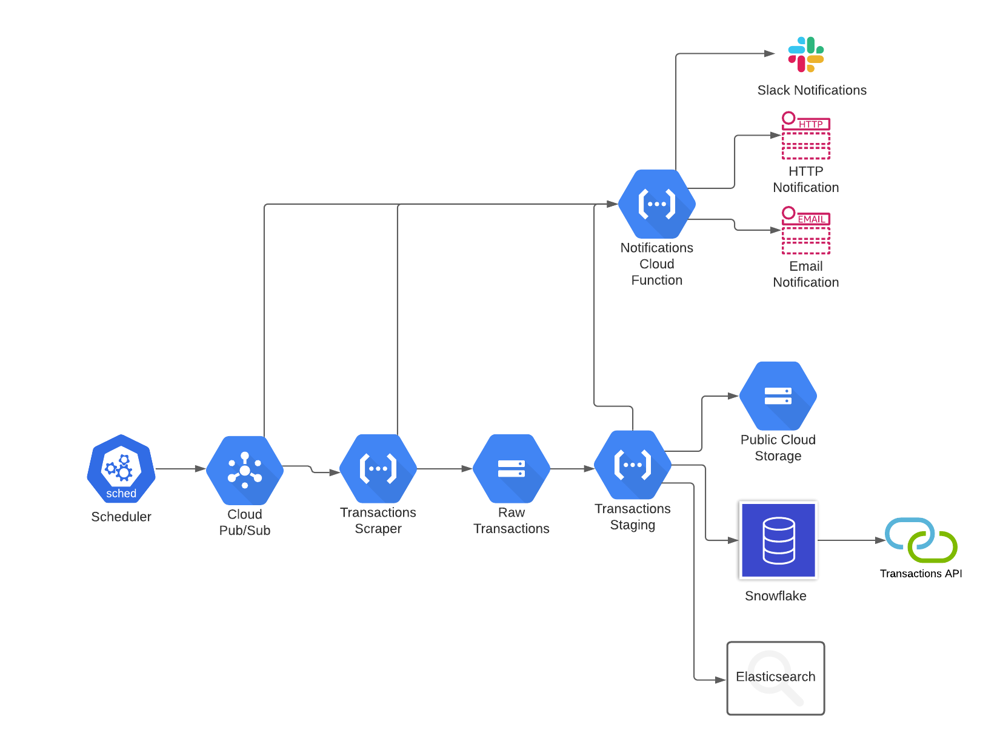

# campaign-finance

## CLI
The CLI documentation can be found in the [cli source code readme](./src/cli/README.md)

## Infrastructure
All infrastructure in this repository is built on Google Cloud Platform and is mostly utilizing its Pub/Sub Topics and Cloud Functions. The Pub/Sub topics serve as a message queue that the cloud functions are subscribed to to kick off events. The current implementation is described in more details in [the Infrastructure Documentation](./docs/Infrastructure.md).

### _Topic_ - `scrape-transactions`
Messages in the form of `{"attributes": {"from": "mm/dd/yyyy", "to": "mm/dd/yyyy", "type": "'rec' | 'exp' | 'all': }}` are sent to this topic describing the start date, end date, and transaction type that should be pulled from the NC State Board of Elections transactions search interface - `https://cf.ncsbe.gov/CFTxnLkup/`. Messages to this topic can be published manually or set up in a Cloud Scheduler to run as a cron job.

### _Cloud Function_ - `transactionsScraper`
This function is triggered by the `scrape-transactions` topic and uses the provided attributes to fill the NC State Board of Elections transactions search interface. When the page loads and the download csv link is rendered it pulls the resulting CSV and stores it in the `dummy-bucket-finance` _( to be renamed )_ bucket.

### _Cloud Storage_ - `dummy-bucket-finance` _( to be renamed )_
This first cloud storage bucket [has a trigger built in](https://cloud.google.com/functions/docs/calling/storage) that publishes events when a new object is created. These events are subscribed to by subsequent cloud functions

### _Cloud Function_ - `transactionsStaging`
This cloud functions listens for file save events from the previous cloud storage bucket and streams the file to a staging bucket - currently `staged-transactions`. The purpose of this function is to run some initial processing on the incoming data files before staging them for public storage and / or ingestion into a database.

## Development

Running functions locally requires authorizing as a service account on the platform. To do this download your service account credentials as a json file and run

`export GOOGLE_APPLICATION_CREDENTIALS=/path/to/service-credentials.json` before running locally.

### Building Functions
Each function is build using typescript and lives in the `src` directory. The functions are bundled separately using webpack into `dist`.

The root `index.js` file imports the commonjs versions of the functions from `dist/cjs/<function_name>.js` and are referenced by name.

### Deploying
The `gcloud functions deploy` command accepts a function name as exported in the `index.js` file. The deployment instructions are below.

#### Event Functions
**First Time Deployment**
First time deployments for each function must specify the function configurations for type, runtime, and trigger topic. Subsequent deployments can ignore those cli options.
`gcloud functions deploy <function_name> --runtime=nodejs16 --trigger-topic=<trigger_topic_name>`

and subsequent deployments can simply be done using
`gcloud functions deploy <function_name>`
#### HTTP Functions
_coming soon_

## Notes:
**Do Not Upgrade to Winston v3.4. It breaks the typescript builds and yields the error `dyld[75099]: missing symbol called` when attempting to run using the @google-cloud/functions-framework**
